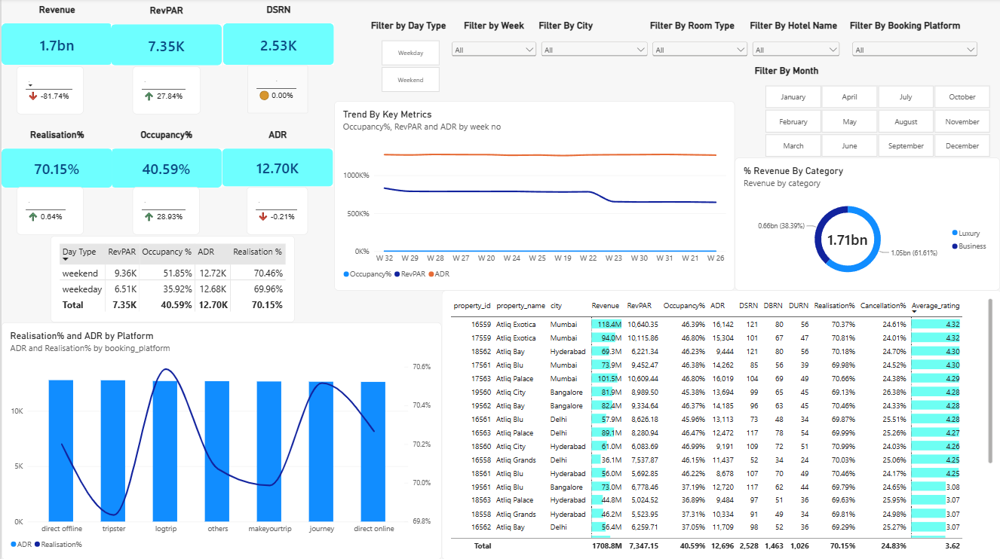

# Hotel Performance Analysis — Power BI Dashboard

## Project overview

This project is an interactive Power BI analysis of hotel performance across properties, cities, room classes, booking platforms, dates, and day types. The dashboard turns booking and capacity data into a management view of revenue, occupancy, pricing, realization, cancellations, and guest ratings.

The report helps answer three practical questions:

- How much revenue is the portfolio generating, and which segments produce it?
- How effectively is available room capacity being used?
- Where do booking losses, weak ratings, or underperforming properties require attention?

## Dashboard features

The main page provides KPI cards for Revenue, RevPAR, DSRN, Realisation %, Occupancy %, and ADR, including week-over-week indicators. It also includes:

- Weekly trends for Occupancy %, RevPAR, and ADR
- Revenue split between Luxury and Business properties
- ADR and Realisation % by booking platform
- Weekend-versus-weekday performance
- Property-level revenue, occupancy, rates, cancellations, and ratings
- Filters for week, city, room type, hotel, booking platform, month, and day type
- Drill/focus views for the principal charts

## Data model

The PBIX uses a small star-style semantic model:

- `fact_bookings`: 134,590 booking records containing status, platform, guests, ratings, and generated/realized revenue
- `fact_aggregated_booking`: daily room capacity and successful-booking aggregates
- `dim_hotels`: 25 property IDs with property name, category, and city
- `dim_rooms`: room IDs and room classes
- `dim_date`: calendar attributes, week numbers, and weekday/weekend classification
- `key_measures`: 25 reusable DAX measures

The model covers **1 May 2022 through 31 July 2022** (92 days).

## Headline results

| KPI | Result |
|---|---:|
| Revenue | 1.7088bn |
| Total bookings | 134,590 |
| Available room-nights (capacity) | 232,576 |
| Checked-out bookings | 94,411 |
| Occupancy | 40.59% |
| ADR | 12.70K |
| RevPAR | 7.35K |
| Realisation | 70.15% |
| Cancellation rate | 24.83% |
| No-show rate | 5.02% |
| Average rating | 3.62 |

Currency is presented in the same units as the source model; the PBIX does not explicitly document a currency code.

## Brief insights

- Luxury properties contribute **61.61%** of revenue (1.053bn), compared with **38.39%** from Business properties (656.0m).
- Weekend occupancy is **51.85%**, versus **35.92%** on weekdays. ADR is almost unchanged, so the weekend RevPAR advantage is primarily occupancy-driven.
- Mumbai is the largest market by revenue at **668.6m**, or roughly **39.1%** of the portfolio total.
- Booking-platform ADR and realisation are tightly clustered. Platform revenue differences are therefore mostly explained by booking volume.
- Revenue was relatively stable over the three months: **581.9m in May**, **553.9m in June**, and **572.9m in July**.

See [BUSINESS_INSIGHTS.md](BUSINESS_INSIGHTS.md) for interview-ready interpretation and [measures.md](measures.md) for the complete DAX measure catalog.

## Repository contents

- `hotel.pbix` — Power BI report and semantic model
- `Screenshots_hotel_analysis/` — dashboard and focused visual screenshots
- `measures.md` — all extracted DAX measures and formulas
- `BUSINESS_INSIGHTS.md` — concise business interpretation and interview notes

## Opening the report

Open `hotel.pbix` in Power BI Desktop. Use the slicers across the top and the day-type/month buttons to change filter context; KPI cards, charts, and the property table respond together.
